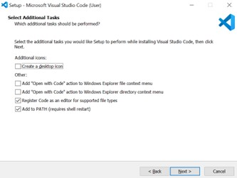

# Lab Report 1
## Set Up instructions

Installing VsCode:
1.	Go to https://code.visualstudio.com/    

 
2.	Click Download for Windows. This will redirect you to another relative site and automatically downloads the VSCodeSetup.exe file
3.	Open the downloaded VSCodeSetup.exe file.
4.	Accept the agreement. Click Next.   
 
5.	Click Next again.   
   
6.	Click Install.  
    
7.	Click Finish.   

 
Remotely Connecting:
1.	Open command prompt
2.	In the terminal, type “ssh cs15lfa22gu@ieng6.ucsd.edu
3.	The following prompt will display:  

 
Type “yes”  
~this only happens once     
4.	After responding, the following prompt will display:
    
Type in my password.    
5.	Upon successful login, the following prompt will display:   
 

Trying Some Commands:
1.	When still logged in at the remote computer, type in the terminal “ls /home/linux/ieng6/cs15lfa22/cs15lfa22gu and this will display the following prompt:   
 
~ “ls” with a pathname lists the files in that path directory

Moving files with scp:
1.	In my computer (not logged in remotely), make a .java file and call it WhereAmI.    
2.	Type in the following code: (I used eclipse to make the file)   
 

3.	Back in the terminal, type in “javac WhereAmI.java” and the following prompt will display:  
   
Make sure you are in the right directory.    
This just compiles the “whereAmI.java” file 
4.	Then type in “scp wherAmI.java cs15lfa22gu@ieng6.ucsd.edu:~/”   
5.	Type in your password to login to the remote computer and copy the “whereAmI.java” file.
Upon successful login the following prompt will display:    
 

6.	Type in “ls” to list the files in your remote computer’s directory. 
     
Here we can see the “whereAmI.java” file we just created.   

Setting an SSH key:
1.	On my computer’s terminal (not logged in to remote computer), type in “ssh key-gen” and the following prompt diplays:   
   
2.	Press “Enter” in your keyboard 3 times. This will save the passphrase (which is empty) so you don’t have to type in your password when logging in to the remote computer.   
   

3.	Since I am on Windows, there is an extra step to follow.
Type in “Get_Service ssh-agen | Set-Service -StartupType Automatic” in the terminal

Unfortunately, these commands were not found in my computer and I’m stuck.

Optimizing Remote Running:
1.	In your terminal, type:
ssh cs15lfa22@ieng6.ucsd.edu "ls"
2.	Then type in your password. Upon successful, the following prompt will display: 

 
This lists out all the files in the remote computer’s directory automatically right after a successful login.

