# Week 7 Lab Report

## Part 1 
### Changing the name of the "start" parameter and its uses to "base" 

Sequence of characters pressed:     
`vim DocSearchServer.java<enter></>start<enter><c><e>base<esc><n><.><n><.><:><w><q>`

Description:   
1. Type vim DocSearchServer.java to edit this file
2. Press `<enter>` to run command
3. Press `</>` then type **"start”** to find the first instance of start from the location of the cursor
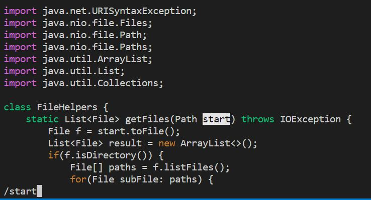
4. Press `<enter>` to run the command and search for the word **"start"**. This places the cursor at the location of "**s**" in **"start"**.
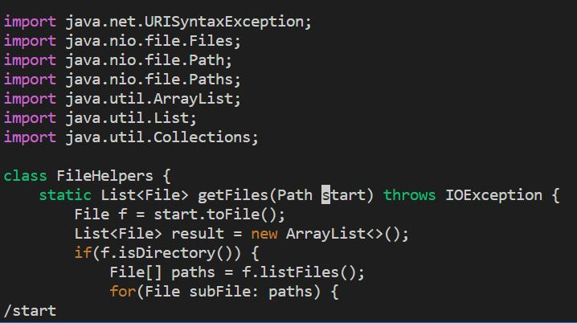
5. Press `<c>` to prompt change command at the location of the cursor.
6. Press `<e>` to prompt end command. This deletes the whole word.
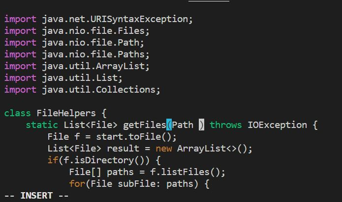
7. Type **"base"**. This replaces the word "**start**" with the word "**base**".
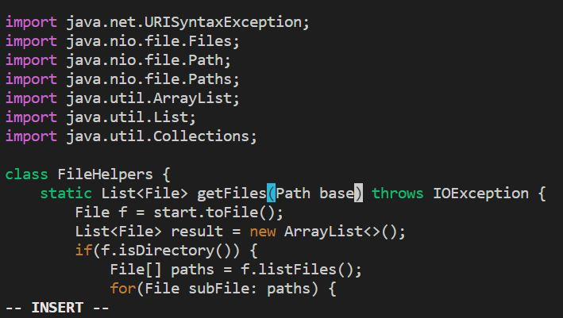
Note that we are in insert mode right now.
8. Press `<esc>` to get back to normal mode
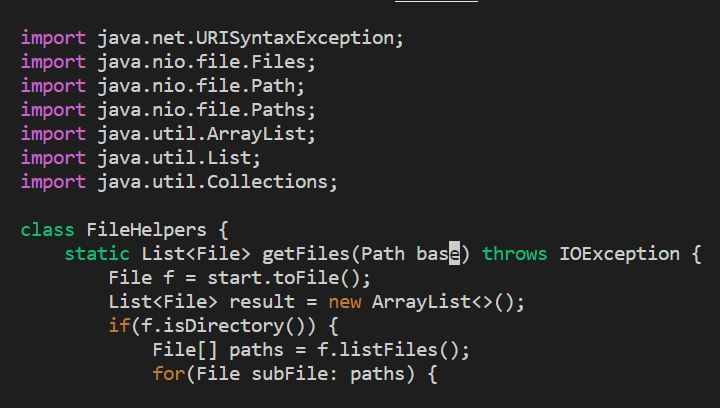
9. Press `<n>` to find the next instance of start 
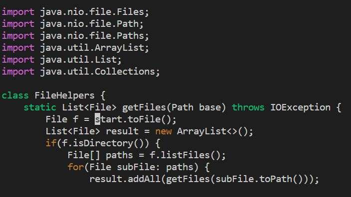
10. Press `<.>` to automatically repeat steps 5 and 6.
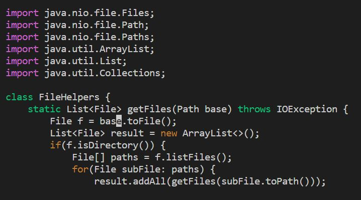
11. We repeated step 9 and 10 until we find and replace all the variables "**start**" with "**base**".    
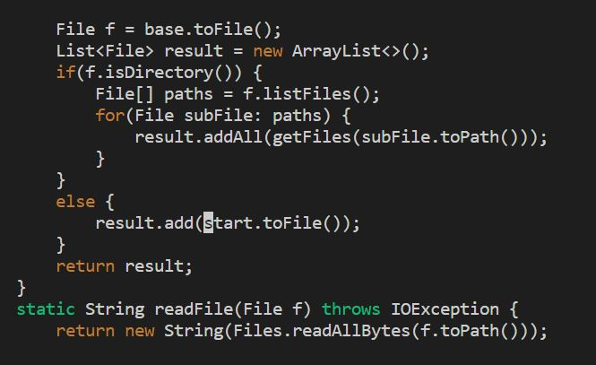 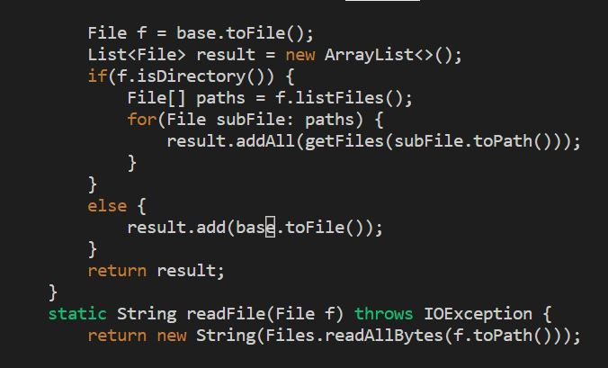 
12. Press `<:><w><q>` sequentially to save changes and exit.   `<w>` stands for write and `<q>` stands for quit.
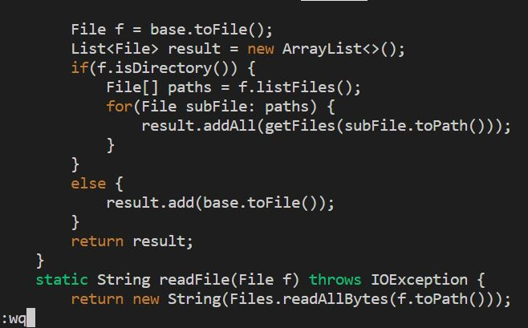
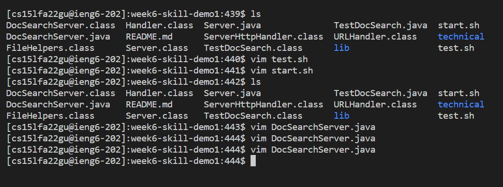
## Part 2
### Comparing two styles of editing files
1. Starting from Visual Studio code and using the scp command to move the file into the remote computer

I'm not particularly fond of this style. Since I have windows, vim doesn't work. So I had to edit the DocSearchServer.java file in Visual studio code, manually look through the lines for the word "start" and change it to "base". Once I found all the word start, I saved it. I then open a terminal and used the scp command to move the file. I made the mistake of copying the the whole directory to the remote computer which wasted a lot more time. It took about a minute to copy over. I then test it out by typing bash test.sh. All in all it took me 10 minutes to do the editing, saving, moving the file to the remote computer and testing it.

2. Start already logged into a ssh session.

When already logged in, I easily edited the file using vim. Using the the keys described in Part 1, I was able to change the word "start" to "base" in under a minute. After replacing, I exited by typing ":wq", and then testing it using bash test.sh. All in all, it only took me 1 minute and 46 seconds to do the task.

Questions:  
1. Which of these two styles would you prefer using if you had to work on a program that you were running remotely, and why?

I prefer using vim already logged into ssh session because it is easier and faster. I don't need to copy over files which may take a lot more time. 

2. What about the project or task might factor into your decision one way or another? (If nothing would affect your decision, say so and why!)

Since I am still very new to vim, I would prefer using visual studio code for a project that I'm not required to run remotely. 

