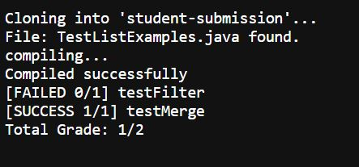
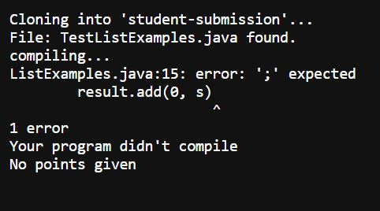

# Week 8 Lab Report

## Part 1 
The following code block is used to grade the repositories in part 2
```
CP=".:../lib/hamcrest-core-1.3.jar:../lib/junit-4.13.2.jar *.java"
McTEST=".:../lib/hamcrest-core-1.3.jar:../lib/junit-4.13.2.jar org.junit.runner.JUnitCore"
FILE="TestListExamples.java"
TOTALPOINTS=0

rm -rf student-submission
git clone $1 student-submission
cp TestListExamples.java student-submission/
cd student-submission

if [[ -f $FILE ]] && [[ -e $FILE ]]
then
    echo "File: $FILE found."
else
    echo "File not found!"
    exit 1
fi

echo "compiling..."
javac -cp $CP

if [[ $? -eq 0 ]]
then
    echo "Compiled successfully"
else
    echo "Your program didn't compile"
    echo "No points given"
    exit 2
fi

java -cp $McTEST TestListExamples > failures.txt

if [[ $(grep -c "testFilter(TestListExamples)" failures.txt) -eq 1 ]]
then
     echo "[FAILED 0/1] testFilter"
else
     TOTALPOINTS=$((TOTALPOINTS+1))
     echo "[SUCCESS 1/1] testFilter"
fi

if [[ $(grep -c "testMerge(TestListExamples)" failures.txt) -eq 1 ]]
then
     echo "[FAILED 0/1] testMerge"
else
     TOTALPOINTS=$((TOTALPOINTS+1))
     echo "[SUCCESS 1/1] testMerge"
fi

echo Total Grade: $TOTALPOINTS/2
```

## Part 2 

This screenshot is taken when grading this repo:
https://github.com/ucsd-cse15l-f22/list-methods-corrected


This screenshot is taken when grading this repo:
https://github.com/ucsd-cse15l-f22/list-methods-compile-error


This screenshot is taken when grading this repo:
https://github.com/ucsd-cse15l-f22/list-methods-lab3


This line:  
 ``` 
 git clone $1 student-submission
 ```
 yielded this output:
`Cloning into 'student-submission'...`  
 Its return code is zero.

 This if statement:     
 ```
 if [[ -f $FILE ]] && [[ -e $FILE ]]
 ```  

returned true and it yielded this result:   
`File: TestListExamples.java found.`
The return code is also zero.

After the if statement, this code run:
```
echo "compiling..." 
```
and outputted: `compiling...`   
Its return code is also zero.

Then we have an if statement:
```
if [[ $? -eq 0 ]]
```
which returned true and outputted: `Compiled successfully`.
Its return code is also zero.

Since it compiled successfully we ran the unit tests with this code:
```
java -cp $McTEST TestListExamples > failures.txt
```
The results were redirected and saved onto failures.txt file.
We then analyze the result using the following codes and decides wether to give scores or not.
In this if statement:
```
if [[ $(grep -c "testFilter(TestListExamples)" failures.txt) -eq 1 ]]
```
It returned true and outputted this result:     
`[FAILED 0/1] testFilter`   
Its return code is one.

This next if statement:
```
if [[ $(grep -c "testMerge(TestListExamples)" failures.txt) -eq 1 ]]
```
returned false and outputted this result:   
`[SUCCESS 1/1] testMerge`   
Its return code is zero.

And finally this code runs:
```
echo Total Grade: $TOTALPOINTS/2
```
which gives the the total points out of how many test ran and outputted this result:    
`Total Grade: 1/2`
